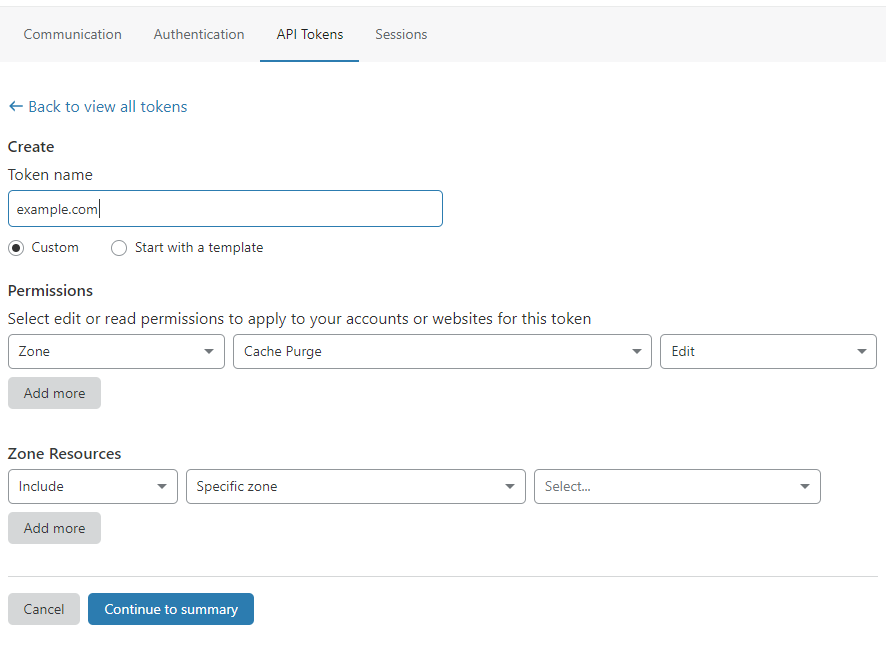

# Cloudflaree

ExpressionEngine extension for [Cloudflare](https://www.cloudflare.com/).

This extension currently purges all the cache. We change this down the road and
give users more granularity over what is purged.

## Settings

This extension requires you to create a new Cloudflare API token with the proper
permissions to purge the cache for your domain. You'll also need to find your
Zone ID for your domain.

### Creating a Token

1. Login to [Cloudflare](https://www.cloudflare.com/)
1. Click the user icon at the top right of the screen
1. Click "**My Profile**"
1. Click "**Api Tokens**"
1. Click "**Create Token**"
1. Give the token a name, your domain name would be fine
1. Under "**Permissions**" change it from "**Account**" to "**Zone**"
1. Also under "**Permissions**" pick "**Cache Purge**"
1. Also under "**Permissions**" pick "**Edit**"
1. Under "**Zone Resources**" we recommend you change that to "**Specific Zone**"
1. Also under "**Zone Resources**" you should pick the domain name for that zone
1. Click "**Continue to summary**"
1. Click "**Create Token**"
1. Copy the token and put it some place safe

#### Screenshot of creating a token

### Finding your Zone ID

When you first go to the page for your domain, your Zone ID is on that page. If
you're on a desktop, it'll be in the right hand column towards the bottom. If
you're on mobile, it'll be near the bottom of the page.

## Resources

* [Where To Find Zone ID?](https://community.cloudflare.com/t/where-to-find-zone-id/132913)
* [Cloudflare API v4 Documentation](https://api.cloudflare.com/)
* [Cloudflare API Documentation on Zones](https://api.cloudflare.com/#zone-properties)
* [Managing API Tokens and Keys](https://support.cloudflare.com/hc/en-us/articles/200167836-Managing-API-Tokens-and-Keys)

## Disclaimer

Not sure if this is needed, but we are in no way affiliated with Cloudflare, Inc.
